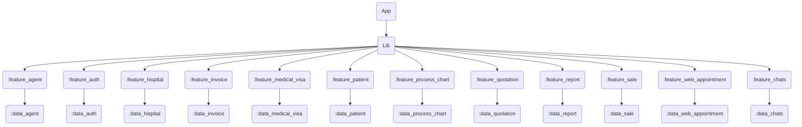
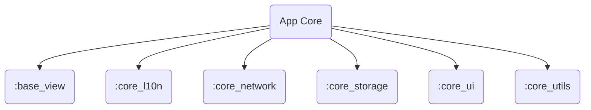

# medical_tourism_mgt

# create module

## Get Started

### 1. Installation

1. Flutter
   `https://docs.flutter.dev/get-started/install`
2. Melos
   `https://melos.invertase.dev/~melos-latest/getting-started`
3. Run `melos setup`

## Debuging

`fvm flutter run -d chrome --web-port 5555`

## Deployment Process

Base View: for menu layout
Core l10n: for translate
Core Network: for api server and model data request/response
Core Storage: for store some cache data (if need)
Core UI: for create widget able to use every feature modules
Core Utils: for create function able to use every feature modules

+++++++++++++++++++++++++++++++++++++++++++++++++++++++++

### Android

### iOS

## Compatibility

## Scripts

Check out `melos.yaml` all available scripts.
